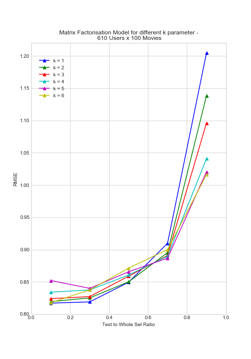

# Personalization Theory Project

## PROBLEM STATEMENT
- For the purposes of tasks presented in HW2, we regard ourselves as a movie recommendation and review website which prides itself with quality recommendations that it is able to generate for its registered users. 
- Our business model is built around selling our customers digital content (like Itunes) and recommending them to subscription services to go and watch their favorite movies. 
- Another part of our job is to engage users on our platform, so that they actively use it to review new movies. It is extremely important to us as it will ensure that we continuously build a growing repository of data that is both rich ( both in qulaity and quantity ) and relevant with changing time.
- Two way we supply these recommendations:
-- Display top recommeded movies on our website dashboard.
-- Sending out emails to registered users with relevant recommednations to keep them engaged with our platform.
- **TLDR**; 
-- **Maximize:** Online Purchases and Website Engagement  
-- **Avoid:** Becoming a Spammer. Focus on Quality Recommendations. 
-- The objective then is to identify what number of active users on platforms should be targeted and with what frequency.
- In easy terms, this task can be be simply understood as making Top 5 recommendations to a carefully selected subset of registered users.

## DATASET:
- We are using the Movielens Dataset. You can find it [here](https://grouplens.org/datasets/movielens/20m/). 
- There were 2 subsets that we created. The small dataset consisted of 610 users and 100 movies while the large dataset consisited of 10000 users and 100 movies. The movies were chosen first after which the dataset was filtered for the users. 
- The movies were the same across both the datasets. 
- You can download our particular subsets from this [link](https://www.dropbox.com/s/bv8cgvze1h1qhmw/E4571_HW2_Dataset.zip?dl=0).

### MODELS AND PARAMETER TUNING
1. Item Based Collaborative Filtering Model 
  ( Hyperparameters: Neighborhood Size - k )
2. Matrix Factorisation with Regularisation
  ( Hyperparameters: Latent Space Dimensions- k; Other Parameters: learning rate - alpha; reg. paramter - beta ) 

### Model 1
- To identify the number of neighbours for the Item Based Collaborative Filtering Model, we split the dataset into 3 different training and testing ratios. 
-- A ratio of 50:50 of the training and test data
-- A ratio of 80:20 of the training and test data
-- A ratio of 90:10 of the training and test data
- Once we had split the data into the training and testing dataset, we chose some different neighbourhood sizes 
- Calculating the RMSE error across the 3 different splits for the different cneighbourhood choices, we chose the neighbourhood size k which achieved the minimum RMSE. 
- To identify the number of latent factors for Matrix Factorisation with Regularisation, we again split the data into different training and testing ratios.
- The k denoting the number of Latent Space Dimensions was chosen based on the RMSE across the different training and testing splits.

To see the impact of neighbourhood sizes, we plotted the graph below
 

Some key points seen were: 
- When we use a single neighbour to predict the ratings, we get a really high root mean square error across the three different splits of training and testing data when the neighbourhood size is 1.
- The lowest root mean square error occurs at an 80:20 train to test split.
- The error is higher at a 90:10 split compared to the 80:20 split. This indicates an overfitting on the training data and the model does not generalize well.
- When using 100 items, a neighbourhood size of 2 gives the best results. A simple model with 2 neighbours is able to explain better than a model which has more number of neighbours.

### Model 2
#### Impact of Sample Size: 
To understand the impact of growing data and increasing sparsity, we divide our projct over two experiments.
- In Experiment 1: With low number of users and low sparsity ( 73 % ), the value of k doesn't make much of a difference.
- In Experiment 2: With more number of users and high sparisty ( 98.34% ), the higher the value of k, lower is the rmse error. Hence we will chose k = 9.

| MF - Small Sample ( 610 Users )  |  MF - Large Sample ( 10k Users )|
|----------------------------------|---------------------------------|
|     |    |

#### Impact of Changing Train-Test Ratio: 
- 


## FUTURE WORK AND COMMENTS ON RESULTS

### Generating Top 5 recommendations
- Desgning
- Checking

#### Design Choices Considered:
- We have chosen to focus mainly on raw ratings for this task and no other source of information is used.
- In both of our models we have not included important features like movie titles, genres and celebrities starring in them. 
- We can also factor in context aware features like time and location. Taking time for example, we would want to study how old are the ratings provided by a user before assigning them equal importance to a recent rating.

## REQUIREMENTS
* Python 3.5 with standard scientific packages (pandas, numpy, scipy, etc.)
* 16 GB of RAM
* About 40 GB free space

## REFERNCE ENVIRONMENT
We ran the models using the following python version and packages:
```
Python 3.5.2 (we used the conda environment)
pandas 0.22.0
numpy 1.14.0
matplotlib 2.0.2
scipy 1.0.0
```
